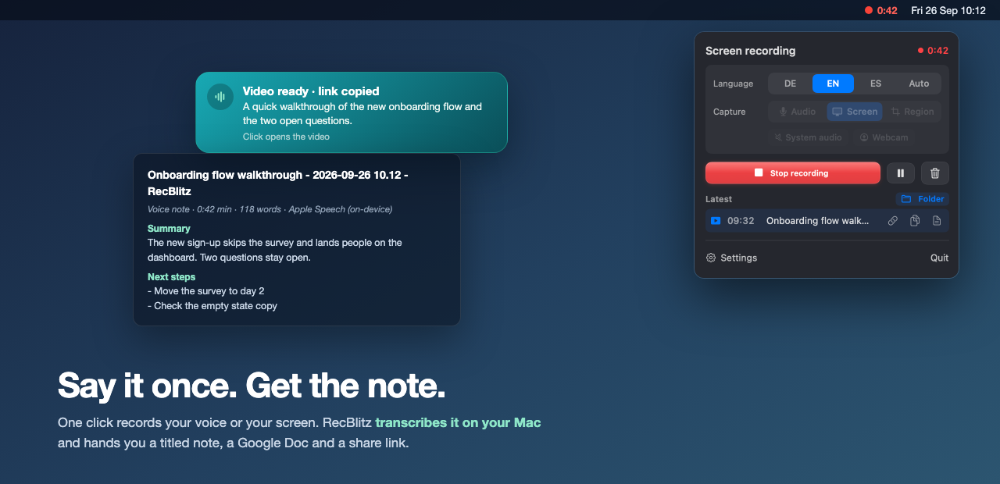
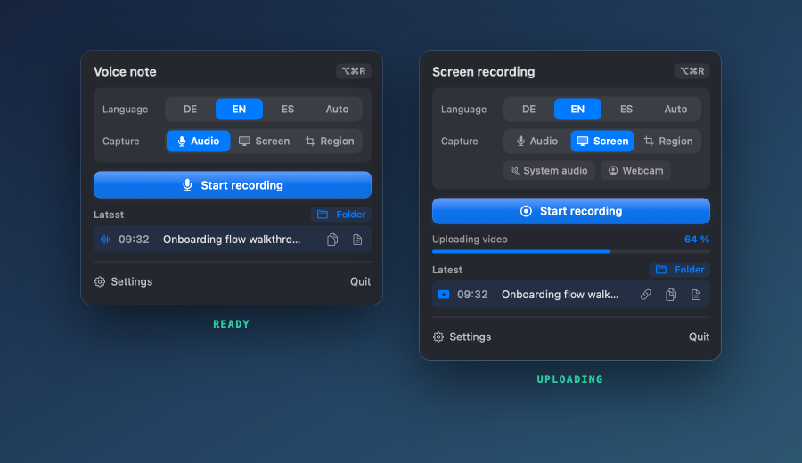

# RecBlitz

**A macOS menu bar app for voice notes and screen recordings that transcribes on your Mac.**
Click the icon, talk, click again. You get a titled Markdown note with the full
transcript, and if you want, a Google Doc and a Drive link to the video on your
clipboard.

### ⬇ [Download RecBlitz 2.0](https://github.com/Felixosk/recblitz-mac/releases/latest/download/RecBlitz.zip)

Ready-made app · 1.8 MB · macOS 14+ (transcription needs macOS 26) · Apple Silicon **and** Intel ·
[one extra command on first launch](#option-a-download-the-ready-made-app) ·
or [build it yourself](#option-b-build-it-yourself) in two minutes

[**Website**](https://felixosk.github.io/recblitz-mac/) ·
[Changelog](CHANGELOG.md) ·
[Deutsche Version](README.de.md) ·
sister app: [MeetingBlitz](https://github.com/Felixosk/meetingblitz-mac)

[](https://github.com/Felixosk/recblitz-mac/actions/workflows/build.yml)



## Why this exists

Most of what I say out loud is gone ten minutes later. The ideas on a walk, the
walkthrough I just gave a colleague, the list of things to fix. Dictation apps
paste text into the window you are in, which is great for writing, but it does
not give you a note you can find next week. Screen recorders give you a video,
and the words stay locked inside it.

RecBlitz does the boring part in between:

1. **One click or ⌥⌘R** starts a voice note. For a screencast pick *Screen* or
   *Region* first, your microphone always runs along.
2. **Apple's speech recognition transcribes it on the Mac** (SpeechAnalyzer,
   macOS 26). A 25 second note is text in about half a second, nothing leaves
   the machine for that step.
3. **A note lands in a folder**, as Markdown with a one-line title, an optional
   summary with next steps, and the transcript. Point it at your Obsidian vault
   and every thought you spoke is searchable.
4. **Optional: Google Drive.** With [rclone](https://rclone.org) set up, the
   same note also becomes a Google Doc, a screencast is uploaded next to it, and
   the share link is on your clipboard when the banner appears.

Native Swift and SwiftUI, no Electron, no server, no account.



## How it compares

Stars as of September 2026. The apps on the right are more mature at what they
do, so pick them if that is all you need.

| | RecBlitz | [Cap](https://github.com/CapSoftware/Cap) | [Handy](https://github.com/cjpais/Handy) | [VoiceInk](https://github.com/Beingpax/VoiceInk) | [QuickRecorder](https://github.com/lihaoyun6/QuickRecorder) |
|---|---|---|---|---|---|
| Records the screen | yes | yes | no | no | yes |
| Transcribes | yes, on the Mac | yes (Cap AI) | yes, on the Mac | yes, on the Mac | no |
| Result | Markdown note, optional Google Doc + Drive link | share link, local export | text pasted into the active app | text pasted into the active app | video file |
| Title + summary per recording | yes, optional | no | no | no | no |
| Account needed | no | yes | no | no | no |
| License | MIT | AGPL-3.0 | MIT | GPL-3.0 | AGPL-3.0 |
| Stars | new | 22.8k | 32.2k | 6.6k | 8.7k |

Honestly: for dictating into other apps, Handy and VoiceInk are
excellent. For a Loom replacement with a team and a web player, use Cap. RecBlitz
is for the case in between: you talk, and you want a note or a Doc afterwards,
with the video attached when there is one.

The closest match in spirit is [Voom](https://github.com/aritropaul/voom)
(native, on-device, screen plus webcam), which uploads to your own Cloudflare
account and does not write notes.

## Features

- **Voice note in one click** from the menu bar, or with **⌥⌘R** without opening anything
- **On-device transcription** with Apple's SpeechAnalyzer, German, English, Spanish or automatic detection
- **Screen or region recording** with your microphone always on, optional system audio (a video, music)
- **Webcam bubble**, round and draggable, recorded into the video
- **Countdown, pause, restart, discard** in a small control bar that never shows up in the recording
- **Ready state** before a screencast: place the region and the webcam, then press record
- **Title and summary** per recording through the Claude command line, if it is installed
- **Markdown note** in any folder, for example your Obsidian vault
- **Google Doc + Drive upload** through rclone, with a share link copied to the clipboard and upload progress in percent
- **Latest recording** in the panel: open the Doc or note, copy the transcript, copy the video link
- **Multiple displays**: pick the screen, a region follows the display you drew it on
- **English and German interface**, switchable live, follows your system language on first run

## Requirements

- **macOS 14 (Sonoma) or newer** to run
- **macOS 26 for the built-in transcription.** On older systems RecBlitz falls back
  to [mlx-whisper](https://github.com/ml-explore/mlx-examples) (`pip3 install mlx-whisper`, Apple Silicon)
- **macOS 15 or newer for screen recording** (microphone and screen share one clock there, so they never drift apart)
- Apple Silicon or Intel, the app builds as a universal binary
- **Xcode Command Line Tools** to build (one-time, see below)

Optional helpers, each one only adds something:

| Tool | Adds | Install |
|---|---|---|
| [rclone](https://rclone.org) | Google Doc, video upload, share link | `brew install rclone`, then `rclone config` (a Google Drive remote) |
| [Claude Code](https://docs.anthropic.com/en/docs/claude-code) | title, summary, next steps | the `claude` command must be on your PATH |
| ffmpeg | one mixed audio track when you record system audio, automatic language detection | `brew install ffmpeg` |
| mlx-whisper | automatic language detection, transcription on macOS 14/15 | `pip3 install mlx-whisper` |

## Install

### Option A: download the ready-made app

Grab `RecBlitz.zip` from the [latest release](https://github.com/Felixosk/recblitz-mac/releases/latest),
unzip it, and move **RecBlitz.app** into your **Applications** folder.

The app is not signed with a paid Apple developer account, so macOS quarantines
it on download. One command clears that flag:

```bash
xattr -dr com.apple.quarantine /Applications/RecBlitz.app
```

Then open it normally. **Understand what that command does:** it tells macOS you
vouch for this app yourself and skips the Gatekeeper check. Only run it on
software you trust. Here you can read every line of the source first, or take
option B and build it yourself.

Without the command you can still launch it the long way: double-click, click
**Done** on the warning, then **System Settings → Privacy & Security → Open
Anyway**, and confirm once more.

### Option B: build it yourself

Two minutes, and no Gatekeeper dance, because software you compile locally is
not quarantined.

```bash
git clone https://github.com/Felixosk/recblitz-mac.git
cd recblitz-mac
./build.sh && open dist/RecBlitz.app
```

If the Command Line Tools are missing, this installs them (a few hundred MB,
one time), then build again:

```bash
xcode-select --install
```

### Good to know

**This app has no window and no dock icon.** It lives in the menu bar, top
right, as a small waveform. If nothing seems to happen after launch, look up
there. If the menu bar is full, macOS hides icons without a word; **⌥⌘R** still
starts a recording.

## Setting up Google Drive (optional)

1. `brew install rclone`, then `rclone config` and create a Google Drive remote,
   for example named `gdrive`.
2. In RecBlitz: **Settings → Google Drive**, switch it on, enter the remote
   (`gdrive:`) and paste the link of the Drive folder for your docs. Videos can
   go to their own folder.
3. Record something. The banner shows *Google Doc ready*, or for a screencast
   *Video ready · link copied*.

Sharing uses `rclone link`, which sets the file to "anyone with the link". Turn
off **Share video** if you want links that only you can open.

## Where your data goes

- Recordings are saved in `~/Library/Application Support/RecBlitz/recordings/`.
  **Settings → General** shows how much space they take.
- Settings live in `~/Library/Application Support/RecBlitz/config.json`.
  [`config.example.json`](config.example.json) lists every key.
- Transcription runs on the Mac. The title and summary are sent to Claude only
  if the `claude` command is installed and **Summary** is on.
- Google Drive is off until you switch it on.
- No server, no telemetry, no account.

## Permissions

- **Microphone**, asked on the first recording.
- **Screen recording**, asked on the first screencast. macOS wants you to allow
  it under **System Settings → Privacy & Security → Screen & System Audio
  Recording**, then restart RecBlitz.
- **Camera**, only for the webcam bubble.

## Troubleshooting

**No Google Doc appears.** Check **Settings → Google Drive**: the green line
means rclone was found. Then run `rclone lsd gdrive:` in Terminal; if that asks
you to log in, the remote needs `rclone config reconnect gdrive:`.

**Transcription fails on macOS 26.** The first run of a language downloads
Apple's speech model once (about 10 seconds). After that it is fast.

**Logs** are in `~/Library/Application Support/RecBlitz/logs/pipeline.log`.

## Test modes

| Flag | Effect |
|---|---|
| `--transcribe <audio> [locale]` | transcribes a file and prints the text |
| `--render-panel <png> [state]` | renders the panel or settings to an image (the pictures in this README) |
| `--selftest` | checks the pure logic, used by `build.sh` |
| `--demo-banner` | shows a result banner for 10 minutes |

## Working on it with Claude Code

There is a [`CLAUDE.md`](CLAUDE.md) with the architecture, the build and the
traps this app has in store. Open Claude Code in this folder and tell it what
you want changed.

## Signing

Without config `build.sh` signs ad-hoc, which means **macOS drops the microphone
and screen permissions on every rebuild**, because it considers the app a new
one. If you build often, create a self-signed certificate and copy
`signing.local.example` to `signing.local`. Instructions are inside that file.

## License

MIT, see [LICENSE](LICENSE).
